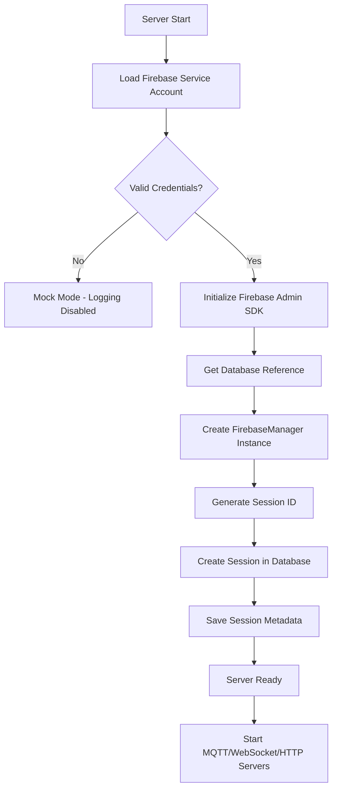
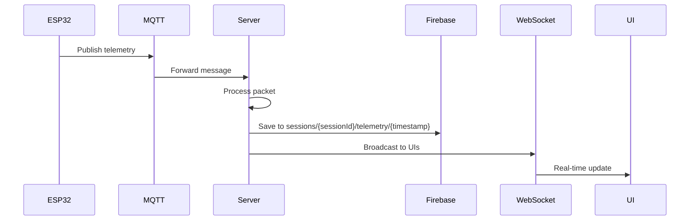

# Firebase Server Flow & Data Management Guide

## Overview

This document explains how Firebase Realtime Database is integrated into the telemetry system, including server startup flow, session management, data storage structure, and data cleanup procedures.

## Firebase Server Startup Flow

### Step-by-Step Initialization



### Detailed Initialization Process

**1. Service Account Loading** (`index.js` lines 15-30)
```javascript
const serviceAccount = require('./serviceAccountKey.json');
```
- Loads Firebase credentials from `serviceAccountKey.json`
- If `project_id` is "YOUR_PROJECT_ID_HERE", runs in mock mode (no Firebase)

**2. Firebase Admin SDK Initialization**
```javascript
admin.initializeApp({
    credential: admin.credential.cert(serviceAccount),
    databaseURL: `https://${serviceAccount.project_id}-default-rtdb.firebaseio.com`
});
db = admin.database();
```
- Initializes Firebase Admin SDK with service account credentials
- Connects to Firebase Realtime Database

**3. Session Creation**
```javascript
firebaseManager = new FirebaseManager(db);
await firebaseManager.createSession();
```
- Creates a new session with timestamp-based ID
- Format: `session_YYYY-MM-DD_HH-MM-SS`
- Example: `session_2026-01-09_14-55-01`

**4. Session Metadata Storage**
```javascript
{
    serverStartTime: "2026-01-09T14:55:01+05:30",
    serverStartTimestamp: 1736418301000,
    description: "Server session started",
    timezone: "Asia/Kolkata"
}
```
- Stored at: `sessions/{sessionId}/metadata`
- Includes ISO timestamp, Unix timestamp, and timezone info

## Database Structure

### Session-Based Organization

```
firebase-realtime-database/
└── sessions/
    ├── session_2026-01-09_14-55-01/
    │   ├── metadata/
    │   │   ├── serverStartTime: "2026-01-09T14:55:01+05:30"
    │   │   ├── serverStartTimestamp: 1736418301000
    │   │   ├── description: "Server session started"
    │   │   └── timezone: "Asia/Kolkata"
    │   └── telemetry/
    │       ├── 1736418310000/
    │       │   └── {telemetry packet data}
    │       ├── 1736418311000/
    │       │   └── {telemetry packet data}
    │       └── ...
    └── session_2026-01-09_15-30-00/
        ├── metadata/
        └── telemetry/
```

### Benefits of Session-Based Storage

✅ **Clear Organization** - Each server restart creates a new session folder  
✅ **Easy Identification** - Session ID includes timestamp in human-readable format  
✅ **Simple Cleanup** - Delete entire sessions without affecting others  
✅ **Historical Tracking** - Keep multiple test runs organized  
✅ **No Data Mixing** - Ground tests and flight data stay separate

## Data Flow

### Telemetry Data Storage Process



**Code Flow:**
1. MQTT client receives message from `rocket/telemetry` topic
2. `processPacket()` function validates and enriches data
3. `firebaseManager.saveTelemetry()` saves to current session
4. Data stored at: `sessions/{currentSessionId}/telemetry/{packet.timestamp_ms}`

## API Endpoints for Data Management

### Public Endpoints (No Authentication)

#### Get Current Session Info
```bash
GET /api/firebase/current-session
```

**Response:**
```json
{
  "sessionId": "session_2026-01-09_14-55-01",
  "serverStartTime": "2026-01-09T14:55:01+05:30",
  "serverStartTimestamp": 1736418301000
}
```

#### List All Sessions
```bash
GET /api/firebase/sessions
```

**Response:**
```json
{
  "sessions": [
    {
      "sessionId": "session_2026-01-09_14-55-01",
      "serverStartTime": "2026-01-09T14:55:01+05:30",
      "serverStartTimestamp": 1736418301000,
      "description": "Server session started",
      "telemetryPackets": 1523
    }
  ]
}
```

#### Get Specific Session Data
```bash
GET /api/firebase/session/:sessionId
```

**Response:**
```json
{
  "sessionId": "session_2026-01-09_14-55-01",
  "metadata": { ... },
  "telemetry": { ... },
  "telemetryCount": 1523
}
```

### Admin-Only Endpoints (Require Authentication)

> [!WARNING]
> All destructive operations require admin authentication via Bearer token.

#### Delete Specific Session
```bash
DELETE /api/firebase/session/:sessionId
Authorization: Bearer {YOUR_TOKEN}
```

**Response:**
```json
{
  "success": true,
  "message": "Session session_2026-01-09_14-55-01 deleted",
  "deletedBy": "admin"
}
```

#### Clear All Firebase Data
```bash
DELETE /api/firebase/all
Authorization: Bearer {YOUR_TOKEN}
Content-Type: application/json

{
  "confirmToken": "DELETE_ALL_DATA"
}
```

> [!CAUTION]
> This permanently deletes ALL data from Firebase. Requires confirmation token.

**Response:**
```json
{
  "success": true,
  "message": "All Firebase data cleared",
  "deletedBy": "admin",
  "timestamp": "2026-01-09T14:55:01.000Z"
}
```

#### Cleanup Mock/Test Data
```bash
POST /api/firebase/cleanup-mock
Authorization: Bearer {YOUR_TOKEN}
Content-Type: application/json

{
  "olderThanHours": 24
}
```

Deletes sessions that are:
- Older than specified hours (default: 24)
- OR have "test" or "mock" in description

**Response:**
```json
{
  "success": true,
  "message": "Cleaned up 5 sessions",
  "deletedSessions": [
    "session_2026-01-08_10-30-00",
    "session_2026-01-08_11-45-00"
  ],
  "cleanedBy": "admin"
}
```

#### Delete Legacy Missions Data
```bash
DELETE /api/firebase/legacy-missions
Authorization: Bearer {YOUR_TOKEN}
```

Removes old `missions/` data structure from previous implementation.

## Data Cleanup Guide

### Method 1: Delete Specific Session (Recommended)

**Step 1:** List all sessions
```bash
curl http://localhost:3001/api/firebase/sessions
```

**Step 2:** Identify session to delete from the list

**Step 3:** Delete the session
```bash
curl -X DELETE http://localhost:3001/api/firebase/session/session_2026-01-09_14-55-01 \
  -H "Authorization: Bearer YOUR_TOKEN_HERE"
```

### Method 2: Cleanup Old Mock Data

**Use Case:** Remove all test sessions older than 24 hours

```bash
curl -X POST http://localhost:3001/api/firebase/cleanup-mock \
  -H "Authorization: Bearer YOUR_TOKEN_HERE" \
  -H "Content-Type: application/json" \
  -d '{"olderThanHours": 24}'
```

### Method 3: Clear All Data (Nuclear Option)

> [!CAUTION]
> Only use this to completely reset the database.

```bash
curl -X DELETE http://localhost:3001/api/firebase/all \
  -H "Authorization: Bearer YOUR_TOKEN_HERE" \
  -H "Content-Type: application/json" \
  -d '{"confirmToken": "DELETE_ALL_DATA"}'
```

### Method 4: Manual Cleanup via Firebase Console

**Step 1:** Open Firebase Console
- Navigate to: https://console.firebase.google.com
- Select your project: `rocket-telemetry-539c5`

**Step 2:** Go to Realtime Database
- Click "Realtime Database" in left sidebar
- Click "Data" tab

**Step 3:** Delete Sessions
- Expand `sessions/` node
- Hover over session to delete
- Click ❌ icon to remove

## Getting Your Auth Token

To use admin-only endpoints, you need a Bearer token:

**Step 1:** Login via Admin Interface
- Open http://localhost:5173
- Login with your admin credentials

**Step 2:** Get Token from Browser
- Open browser DevTools (F12)
- Go to Console tab
- Type: `localStorage.getItem('authToken')`
- Copy the token value

**Step 3:** Use Token in API Calls
```bash
curl -H "Authorization: Bearer eyJhbGc..." http://localhost:3001/api/firebase/sessions
```

## Troubleshooting

### Firebase Not Initializing

**Symptom:** `[Backend] Firebase Key is MOCK. Cloud logging disabled.`

**Solution:**
1. Check `server/serviceAccountKey.json` has valid credentials
2. Ensure `project_id` is NOT "YOUR_PROJECT_ID_HERE"
3. Verify Firebase project exists in console

### Session Not Created

**Symptom:** No session appears in Firebase Console

**Solution:**
1. Check server logs for session creation message
2. Verify Firebase database rules allow writes
3. Check database URL matches your project

### Data Not Saving

**Symptom:** Telemetry received but not in Firebase

**Solution:**
1. Verify `firebaseManager` is initialized (check logs)
2. Check packet has `timestamp_ms` field
3. Look for Firebase write errors in server logs

### Cannot Delete Data

**Symptom:** `401 Unauthorized` when calling delete endpoints

**Solution:**
1. Ensure you're sending `Authorization: Bearer {token}` header
2. Verify token is valid (try re-logging in)
3. Check token hasn't expired

## Best Practices

### For Development/Testing
- Use `cleanup-mock` endpoint regularly to remove old test data
- Mark test sessions with "test" in description for auto-cleanup
- Keep sessions under 24 hours for automatic cleanup

### For Production/Flight
- Create new session for each flight day
- Don't delete flight data sessions
- Export important data before cleanup
- Use descriptive session metadata

### Database Maintenance
- Monitor database size in Firebase Console
- Clean up old sessions monthly
- Keep only critical flight data long-term
- Use Firebase export for backups

## Migration from Legacy Structure

If you have old data in `missions/` structure:

**Step 1:** Export old data (optional)
- Use Firebase Console to export data
- Or use Firebase Admin SDK to read and save locally

**Step 2:** Delete legacy data
```bash
curl -X DELETE http://localhost:3001/api/firebase/legacy-missions \
  -H "Authorization: Bearer YOUR_TOKEN_HERE"
```

**Step 3:** Restart server
- New session-based structure will be used automatically

---

**Questions or Issues?** Check server logs for detailed error messages and Firebase Console for real-time database state.
